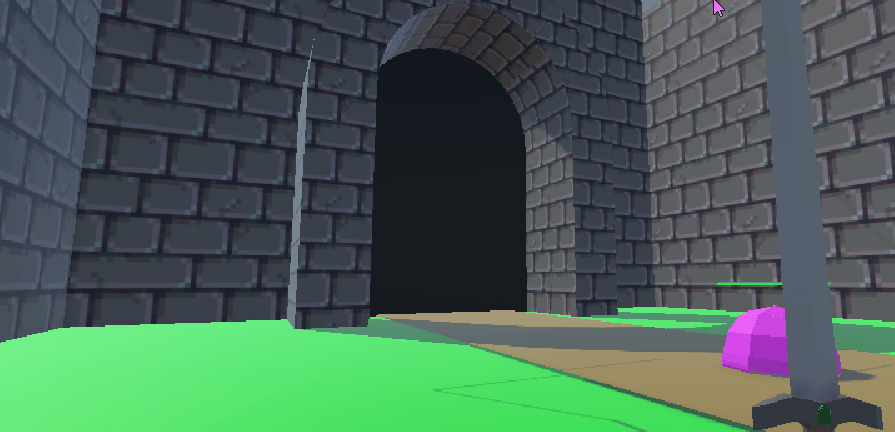

# Castle SLimes
##### We have five mechanics
[Script](https://github.com/Jonah-Robojoon/Castle-Slimes/tree/main/Assets/Scripts)

## First mechanic
##### Made the player move jump nad rotate camera with wasd
##### Reason: we want the player to be able to move to the enemy and do so in a smooth and controllable way.
[Script](https://github.com/Jonah-Robojoon/Castle-Slimes/blob/main/Assets/Scripts/PlayerMovement.cs)

## Second mechanic
##### Made The slime Ai that follows a path
##### Reason: we want a point of the game, why you should be playing. our idea was to save the castle from slimes. so ehy would have to move towards the gate.
[Script](https://github.com/Jonah-Robojoon/Castle-Slimes/blob/main/Assets/Scripts/Slime.cs)

## third mechanic
##### made slime hp bar
##### Reason: we wanted a way to kill the slime. otherwise it was just a sad story about how slimes took over a castle without you being able to do anything.
[Script](https://github.com/Jonah-Robojoon/Castle-Slimes/blob/main/Assets/Scripts/HpBar.cs)

## Forth machanic
##### Made the player able to attack with a sword with animations
##### Reason: we wanted the attack to feel like your doing something. and wanted to give te player feedback that you actualy hit the attack button.
[Script](https://github.com/Jonah-Robojoon/Castle-Slimes/blob/main/Assets/Scripts/PlayerAttack.cs)
## Fith machanic
##### Made a gate at the end of the slime path. if health is 0 you lost
##### Reason: we needed a end of the game so thats why we made the gate
[Script](https://github.com/Jonah-Robojoon/Castle-Slimes/blob/main/Assets/Scripts/gate.cs)

## sixth mechanic
Made a inf wave system for the slimes
Reason: we wanted it go on forever. so now we have a wave system
[Script](https://github.com/Jonah-Robojoon/Castle-Slimes/blob/main/Assets/Scripts/Enemyspawner.cs)

